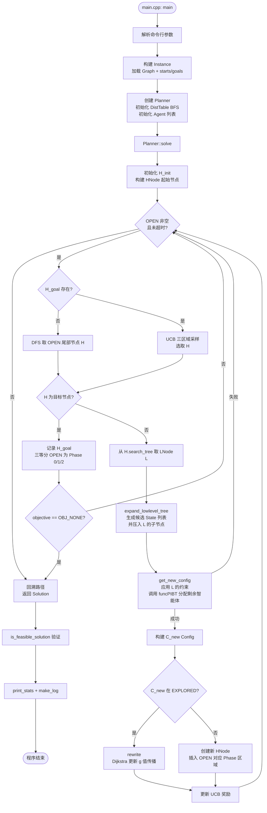

# PROJECT_DOCUMENTATION.md
# LaCAM_T_extend — 项目深度技术文档

> 本文档基于对 `LaCAM_T_extend` 代码仓库的全面静态分析生成，旨在指导二次开发与算法扩展。

---

## 目录

1. [项目概览与执行流](#1-项目概览与执行流)
2. [代码架构剖析](#2-代码架构剖析)
3. [核心算法与内在逻辑](#3-核心算法与内在逻辑)
4. [关键数据结构](#4-关键数据结构)
5. [可视化流程图](#5-可视化流程图)
6. [二次开发指南](#6-二次开发指南)

---

## 1. 项目概览与执行流

### 1.1 项目定位

本项目是论文 *"Improving LaCAM for Scalable Eventually Optimal Multi-Agent Pathfinding"*（IJCAI-23）中 LaCAM2 算法的**扩展版本**，核心创新点是在原有多智能体路径规划（MAPF）框架中引入了**朝向（Orientation）约束**。

智能体不再是可以任意转向的无方向实体，而是具备四个离散朝向（东/西/南/北）的有向实体。每个时间步，智能体只能执行以下三类动作之一：
- **原地等待（Wait）**：位置与朝向均不变
- **原地转向（Rotate）**：位置不变，朝向旋转 90°（顺时针或逆时针）
- **向前移动（Move Forward）**：只能向当前朝向的正前方格移动，朝向保持不变

### 1.2 入口文件

**`main.cpp`** 是程序唯一的入口，包含 `main()` 函数。

### 1.3 程序启动与整体执行流

```
main() [main.cpp]
  │
  ├─ 1. 解析命令行参数（argparse）
  │      -m  地图文件 (.map)
  │      -i  场景文件 (.scen)，可选
  │      -N  智能体数量
  │      -s  随机种子
  │      -t  时间上限（秒）
  │      -O  优化目标 (0=无, 1=makespan, 2=sum_of_loss)
  │      -r  随机重启率
  │
  ├─ 2. 构建实例 Instance
  │      从地图文件解析 Graph
  │      从场景文件或随机生成 starts / goals
  │
  ├─ 3. 调用 solve() [lacam2.cpp]
  │      → 构建 Planner 对象
  │      → 调用 Planner::solve()
  │
  ├─ 4. 可行性验证 is_feasible_solution()
  │
  └─ 5. 后处理
         print_stats() — 控制台输出统计
         make_log()    — 写入结果文件
```

### 1.4 数据输入输出

| 类型 | 格式 | 描述 |
|------|------|------|
| 输入：地图文件 | MovingAI `.map` 格式 | 含 `height`/`width` 头信息，`@` 或 `T` 表示障碍 |
| 输入：场景文件 | MovingAI `.scen` 格式 | 每行含起点坐标与终点坐标 |
| 输出：结果文件 | 自定义文本格式 | 含 agents, map_file, soc, makespan, solution 等字段 |

结果文件每个时间步输出一行，格式为：
```
t:(x0,y0,ORIENTATION),(x1,y1,ORIENTATION),...
```

---

## 2. 代码架构剖析

### 2.1 目录结构

```
LaCAM_T_extend/
├── main.cpp                  # 程序入口，负责参数解析与总调度
├── CMakeLists.txt            # 顶层构建文件，链接 lacam2 库
├── lacam2/
│   ├── CMakeLists.txt        # 静态库构建配置（C++17, -O3）
│   ├── include/
│   │   ├── orientation.hpp   # 朝向枚举定义（新增核心类型）
│   │   ├── utils.hpp         # 时间管理、随机工具函数
│   │   ├── graph.hpp         # 图结构、State 定义、ConfigHasher
│   │   ├── instance.hpp      # 问题实例定义（地图+起点+终点）
│   │   ├── dist_table.hpp    # 朝向感知距离表（含 BFS 懒惰求值）
│   │   ├── planner.hpp       # 规划器、HNode、LNode、Agent 定义
│   │   ├── post_processing.hpp # 解的质量评估与日志输出
│   │   └── lacam2.hpp        # 公开接口：solve() 函数声明
│   └── src/
│       ├── graph.cpp         # Graph 加载、Config 比较、哈希
│       ├── instance.cpp      # Instance 三种构造方式
│       ├── dist_table.cpp    # 朝向感知 BFS 距离计算
│       ├── planner.cpp       # 核心求解逻辑（HNode/LNode 搜索 + PIBT）
│       ├── lacam2.cpp        # solve() 桥接函数
│       ├── post_processing.cpp # 解验证、统计计算、日志写入
│       └── utils.cpp         # Deadline、随机数实现
├── assets/                   # MAPF 基准测试地图与场景
├── tests/                    # 单元测试文件
├── third_party/              # argparse 等第三方库
└── data_process_test.py      # 数据处理辅助脚本
```

### 2.2 模块职责与调用关系

| 模块 | 职责 |
|------|------|
| `orientation.hpp` | 定义 `Orientation` 枚举（X_PLUS/Y_PLUS/X_MINUS/Y_MINUS），提供方向字符串转换 |
| `utils.hpp/cpp` | `Deadline`（计时器）、`get_random_float/int`（随机数）、`info()`（带层级的日志） |
| `graph.hpp/cpp` | 加载 `.map` 文件，构建邻接图；定义 `Vertex`、`State`（位置+朝向）、`Config`（全员状态）、`ConfigHasher` |
| `instance.hpp/cpp` | 封装问题实例，支持场景文件加载、随机生成和测试用构造；持有 `Graph G`、`Config starts`、`Config goals` |
| `dist_table.hpp/cpp` | 为每个智能体对每个 `(Vertex, Orientation)` 状态预计算到目标的最短代价，使用完全 BFS（Eager 模式） |
| `planner.hpp/cpp` | 实现两层搜索：高层 DEQUE + UCB 策略，低层约束树 + PIBT；包含 Swap 操作、k-Push Escape Trigger、环路检测等增强逻辑 |
| `lacam2.hpp/cpp` | 提供统一的 `solve()` 接口，隐藏 `Planner` 细节 |
| `post_processing.hpp/cpp` | 验证解的物理合法性（无顶点冲突、无边冲突、朝向合法）；计算 makespan/sum_of_costs/sum_of_loss 及下界；写结果日志 |

### 2.3 模块依赖图

```
main.cpp
  └─ lacam2.hpp
       ├─ graph.hpp ← orientation.hpp ← utils.hpp
       ├─ instance.hpp
       ├─ dist_table.hpp
       ├─ planner.hpp
       └─ post_processing.hpp
```

---

## 3. 核心算法与内在逻辑

### 3.1 LaCAM* 两层搜索框架（`Planner::solve()`）

LaCAM* 是一种**两层（Bi-level）搜索**框架：

- **高层（High-Level）**：以完整的多智能体配置 `Config`（所有智能体的状态集合）作为搜索节点，构建高层搜索图（DAG），目标是找到从 `starts` 到 `goals` 的配置转移序列。
- **低层（Low-Level）**：对每个高层节点，使用约束树（Constraint Tree）逐步枚举可行的下一时刻配置；通过 PIBT 算法为当前约束分配具体动作。

**两阶段搜索策略（关键扩展）：**

| 阶段 | 策略 | 目标 |
|------|------|------|
| **阶段 1（找初始解）** | 纯 DFS（从 DEQUE 尾部取节点） | 尽快找到一个可行解 |
| **阶段 2（优化阶段）** | UCB 三区域采样（从 DEQUE 中按 UCB 分数选区域） | 找到更低代价的解 |

**UCB 三区域划分：**  
找到初始解后，将 OPEN 表按位置三等分为 Phase 0（前端，旧节点）、Phase 1（中部）、Phase 2（后端，新节点），通过 UCB（Upper Confidence Bound）公式平衡探索与利用：

```
UCB(phase_i) = avg_reward_i + C * sqrt(ln(N+1) / n_i)
```

### 3.2 PIBT 低层冲突消解（`Planner::funcPIBT()`）

PIBT（Priority-based Incremental Backtracking）是低层配置生成的核心。

**执行流程：**

1. **候选节点排序**：为当前智能体 `ai` 生成所有候选下一位置（邻居 + 原地）。对每个候选位置，计算「转向代价 + 到目标的距离」，升序排列。加入随机扰动 tie-breaker 防止死锁。
2. **Swap 检测**：调用 `swap_possible_and_required()` 检测是否需要与相向而行的智能体交换位置，若需要则反转候选列表。
3. **Reserved Node 处理**：若该智能体有保留节点（上一步正在转向），优先选择保留节点。
4. **k-Push Escape Trigger**：若某智能体被同一 pusher 连续推了 `k≥2` 次，打乱候选列表以逃离局部死锁。
5. **递归推挤**：若最佳候选位置被智能体 `ak` 占据，递归调用 `funcPIBT(ak, ai)` 尝试将 `ak` 推走。
6. **环路检测**：若递归推挤形成闭环，调用 `handleCycleWithOrientation()` 协调所有环路成员同步转向后移动。
7. **动作计算**：调用 `computeAction(current, target, current_orient)` 决定物理动作（等待/旋转/移动）。

### 3.3 朝向感知距离表（`DistTable::createDistanceTableWithOrientation()`）

这是本项目相较于原始 LaCAM2 最核心的改动之一。

**原理**：对每个智能体 `i`，在「状态空间」（而非单纯的顶点空间）上进行**反向 BFS**，计算从任意 `(Vertex, Orientation)` 状态到达目标位置所需的最少步数（含转向步数）。

**表索引**：`table[agent_id][vertex_id * 4 + orientation]`，共 `N × (V × 4)` 个条目。

**BFS 逆向扩展规则**：
- **逆向旋转**：若当前状态 `(u, dir)` 可通过旋转到达，则其 90° 相邻朝向的前驱距离 = 当前距离 + 1。
- **逆向移动**：若某邻居 `v` 朝向 `dir` 能向前走到 `u`（即 `v→u` 方向 = `dir`），则 `(v, dir)` 的前驱距离 = 当前距离 + 1。
- **目标初始化**：目标位置的所有 4 个方向距离均初始化为 0（到达目标位置后，无论朝向均视为完成任务）。

---

## 4. 关键数据结构

### 4.1 基础类型

```cpp
// orientation.hpp
enum class Orientation { X_PLUS=0, Y_PLUS=1, X_MINUS=2, Y_MINUS=3 };

// graph.hpp
struct Vertex {
    const uint id;     // 在 V（非空顶点列表）中的紧凑索引
    const uint index;  // 在 U（全网格展平数组）中的索引：width*y + x
    std::vector<Vertex*> neighbor;
};

struct State {
    Vertex* v;   // 位置
    Orientation o; // 朝向
};

using Config   = std::vector<State>;   // 全部 N 个智能体的状态快照
using Solution = std::vector<Config>;  // 时间序列上的 Config 集合
```

**Config 哈希（`ConfigHasher`）**：同时混合位置 id 和方向枚举值，用于 `EXPLORED` 哈希表去重。

### 4.2 问题实例

```cpp
struct Instance {
    const Graph G;    // 加载的地图图结构
    Config starts;    // 起始状态序列（含朝向）
    Config goals;     // 目标状态序列（含位置，朝向不参与终止判定）
    const uint N;     // 智能体数量
};
```

### 4.3 距离表

```cpp
struct DistTable {
    const uint V_size;           // 顶点数量
    const uint width;            // 地图宽度（用于计算移动方向）
    std::vector<std::vector<uint>> table;  // table[i][v_id*4 + orient]
    // 获取: agent i 从 State(v, o) 到目标的最短距离
    uint get(uint i, Vertex* v, Orientation o);
};
```

### 4.4 高层节点（HNode）

```cpp
struct HNode {
    const Config C;          // 该节点对应的多智能体配置
    HNode* parent;           // 在搜索树中的父节点（用于回溯解路径）
    std::set<HNode*> neighbor; // 图邻居（用于 rewrite/Dijkstra 优化传播）
    uint g, h, f;            // g: 从 starts 的实际代价; h: 启发值; f = g + h
    std::vector<float> priorities; // PIBT 动态优先级
    std::vector<uint> order;       // 按优先级排好的智能体处理顺序
    std::queue<LNode*> search_tree; // 当前节点尚未展开的低层约束
};
```

### 4.5 低层节点（LNode）

```cpp
struct LNode {
    std::vector<uint>  who;   // 已分配动作的智能体 id 列表
    std::vector<State> where; // 对应的下一时刻状态（位置+朝向）
    const uint depth;         // 当前已约束的智能体数量
};
```

**HNode 与 LNode 的关系**：每个 HNode 维护一个 `search_tree`（LNode 队列），每次从队首取出一个 LNode 进行「低层扩展 → 约束补全 → PIBT 分配 → 生成新 Config」的完整流程。

### 4.6 智能体（Agent）

```cpp
struct Agent {
    const uint id;
    Vertex* v_now;  Orientation o_now;   // 当前时刻状态
    Vertex* v_next; Orientation o_next;  // 待分配的下一时刻状态
    bool swap_completed;                 // Swap 操作完成标志
};
```

### 4.7 数据结构关系图

```
Instance
  ├─ Graph (Vertex[], U[], width, height)
  ├─ Config starts  [State{Vertex*, Orientation}]
  └─ Config goals   [State{Vertex*, Orientation}]

Planner
  ├─ DistTable D      (table[N][V*4])
  ├─ Agents A         (Agent*[N])
  ├─ occupied_now/next (Agent*[V_size])  ← 快速碰撞检测
  ├─ reserved_nodes    (Vertex*[N])      ← 转向保留节点
  ├─ push_count_table  (int[N][N])       ← k-Push 计数
  └─ OPEN (deque<HNode*>)
       └─ HNode
            └─ search_tree (queue<LNode*>)
```

---

## 5. 可视化流程图

### 5.1 顶层执行流程



### 5.2 PIBT 低层动作分配流程

```mermaid
flowchart TD
    A([funcPIBT: ai]) --> B[计算候选位置 P\n邻居 + 原地\n按代价+随机扰动排序]
    B --> C{k-Push\nEscape\nTrigger?}
    C -- 触发 --> D[随机打乱 P]
    C -- 未触发 --> E{需要 Swap?}
    D --> E
    E -- 是 --> F[反转 P]
    E -- 否 --> G{有 Reserved Node?}
    F --> G
    G -- 是 --> H[将保留节点提至 P 首位]
    G -- 否 --> I[遍历 P 中候选节点 u]
    H --> I

    I --> J{occupied_next\[u\] 被占?}
    J -- 是 --> K[跳过, m++]
    K --> I

    J -- 否 --> L{u == 初始请求者位置\n且非初始调用?}
    L -- 是 --> M[形成环路\nhandleCycleWithOrientation\n协调所有成员转向/移动]
    M --> Z([return true])

    L -- 否 --> N{u 被 ak 占据\nak 尚未分配?}
    N -- 是 --> O[递归 funcPIBT ak\n以 ai 为 pusher]
    O -- 失败 --> P[回退, m++]
    P --> I
    O -- 成功 --> Q

    N -- 否 --> Q[computeAction\n计算物理动作\n等待/转向/前进]
    Q --> R{next_node == v_now?}
    R -- 是 --> S[原地等待或转向\n保存 reserved_node]
    R -- 否 --> T[前进到 next_node\n清除 reserved_node]

    S --> Z2([return true])
    T --> Z2

    I -- 所有 u 失败 --> U[ai 原地等待\nreturn false]
```

---

## 6. 二次开发指南

### 6.1 添加新的运动模型（动作集合）

**目标**：修改智能体的合法动作，例如允许斜向移动、原地 180° 转身一步完成、或自定义运动约束。

**需要修改的位置：**

1. **`lacam2/src/planner.cpp` → `expand_lowlevel_tree()`**  
   这是生成候选 `State` 的唯一入口。当前支持：等待（Wait）、左转、右转、向前移动。  
   在此处添加或修改候选 State 的生成逻辑。

2. **`lacam2/src/dist_table.cpp` → `createDistanceTableWithOrientation()`**  
   距离表的 BFS 反向扩展规则必须与运动模型保持同步。若添加了新动作，需对应添加其"逆向动作"的扩展规则。

3. **`lacam2/src/planner.cpp` → `computeAction()`**  
   PIBT 实际执行阶段调用此函数决定物理动作。需保证与候选动作集合一致。

4. **`lacam2/src/post_processing.cpp` → `is_feasible_solution()`**  
   合法性验证须同步更新，允许或拒绝新的动作类型。

### 6.2 添加新的优化目标

**目标**：除 makespan、sum_of_loss 外，支持自定义代价函数（如 sum_of_turns 转向次数之和）。

**需要修改的位置：**

1. **`lacam2/include/planner.hpp` → `Objective` 枚举**  
   添加新枚举值，例如 `OBJ_SUM_OF_TURNS`。

2. **`lacam2/src/planner.cpp` → `get_edge_cost(const Config&, const Config&)`**  
   为新目标添加代价计算分支。

3. **`lacam2/src/planner.cpp` → `get_h_value(const Config&)`**  
   为新目标添加启发值计算分支（通常是从 `DistTable` 查询的聚合值）。

4. **`main.cpp`**  
   在 `--objective` 参数的合法值列表中添加新选项，并转换为新枚举值。

### 6.3 替换高层搜索策略

**目标**：将当前的 DEQUE + UCB 三区域采样替换为其他策略（如 A*、GBFS、MCTS）。

**核心修改位置**：`lacam2/src/planner.cpp` → `Planner::solve()` 中的主循环。

关键接口不变：
- `expand_lowlevel_tree(H, L)` — 展开低层约束树
- `get_new_config(H, L)` — 生成新配置（调用 PIBT）
- `rewrite(H_from, T, H_goal, OPEN, boundary)` — 路径代价更新传播

只需改变 `OPEN` 容器的类型和 `H` 的取出/放回逻辑即可。例如替换为优先队列实现 A*：

```cpp
// 将 std::deque<HNode*> OPEN 替换为：
auto cmp = [](HNode* a, HNode* b) { return a->f > b->f; };
std::priority_queue<HNode*, std::vector<HNode*>, decltype(cmp)> OPEN(cmp);
```

### 6.4 修改低层冲突消解策略（替换 PIBT）

**目标**：使用其他低层算法（如 CBS、ECBS、PP）替代 PIBT。

**需要修改的位置**：

1. **`lacam2/src/planner.cpp` → `get_new_config(HNode* H, LNode* L)`**  
   这是低层算法的调用入口。当前逻辑：读取 LNode 中的约束 → 调用 `funcPIBT` 分配剩余智能体。  
   替换时，需保证：执行结束后，所有 `Agent::v_next` 和 `Agent::o_next` 已被合法赋值，且无顶点/边冲突。

2. **`lacam2/src/planner.cpp` → `funcPIBT()`**  
   可完整替换此函数的实现，外部接口签名保持不变即可。

### 6.5 添加新地图格式

**目标**：支持除 MovingAI `.map` 格式以外的地图输入。

**修改位置**：`lacam2/src/graph.cpp` → `Graph::Graph(const std::string& filename)`  
按新格式解析 `width`、`height` 和障碍物标记，填充 `V`（非空顶点列表）和 `U`（含空的网格展平数组），并按同样方式建立边（四邻域连通）。

### 6.6 扩展朝向数量（如 8 方向）

**目标**：将朝向从 4 个离散方向扩展为 8 个（增加斜向）。

**需要修改的文件链**：

1. `lacam2/include/orientation.hpp` — 添加 4 个斜向枚举值
2. `lacam2/src/dist_table.cpp` — `get_index()` 的乘数从 4 改为 8，BFS 扩展规则添加斜向逆向移动
3. `lacam2/src/planner.cpp` — `expand_lowlevel_tree()` 候选生成；`get_direction()` 辅助函数；`computeAction()` 转向逻辑
4. `lacam2/src/post_processing.cpp` — `get_move_dir()` 辅助函数
5. `lacam2/include/graph.hpp` — `ConfigHasher` 中的移位量（当前 `<< 2` 对应 4 方向，改为 `<< 3`）

---

## 附录：关键宏观参数对照

| 参数 | 类型 | 作用 | 默认值 |
|------|------|------|--------|
| `RESTART_RATE` | float | 随机重启概率（当前未在主循环使用，仅保留接口） | 0.001 |
| `k` in k-Push | int | 连续推挤触发阈值（`PushEscapeTrigger` 中硬编码） | 2 |
| UCB `c` | double | UCB 探索系数 | 1.414 |
| `OBJ_NONE` / `OBJ_MAKESPAN` / `OBJ_SUM_OF_LOSS` | Objective | 优化目标，控制 `get_edge_cost` 和 `get_h_value` | `OBJ_NONE` |
| `time_limit_sec` | int | 总搜索时间上限（秒） | 3 |
